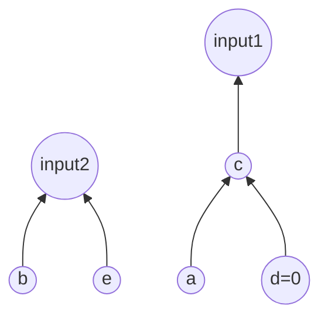
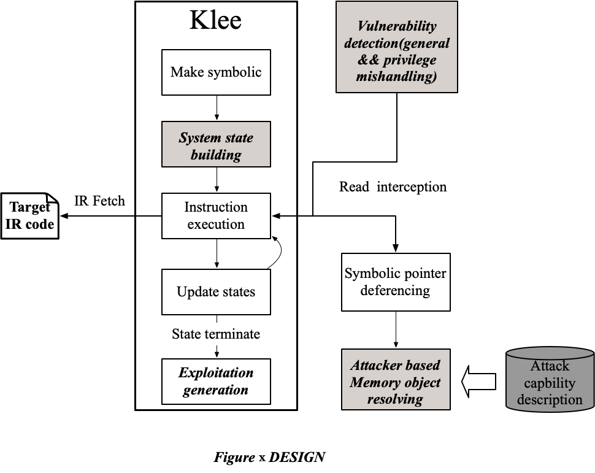
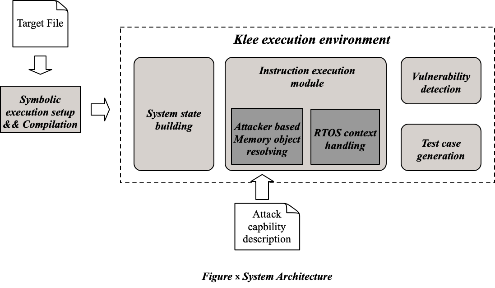
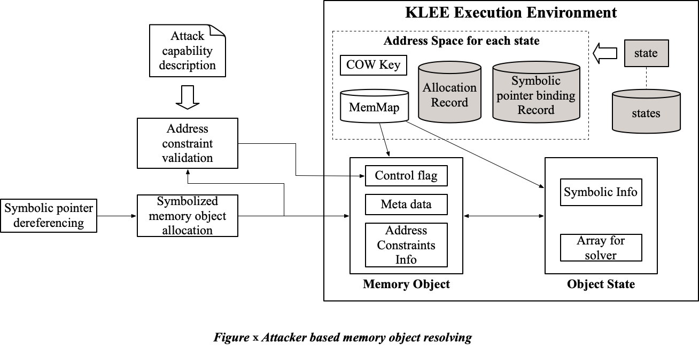

# DESIGN

## 检测机制

检测机制，以任意写为例：遇到符号指针解引用操作时，如C语言中*a=b，首先检查a与b是否都是攻击者可控制的符号值，若是，再检查a是否能指向攻击者定义的危险区域，如(if MPU_REGISITER_START < a && a< MPU_REGISITER_END), 若是，则该位置存在问题。

注意，目前检测机制针对的是API在实现上存在问题，暂不能检测功能上存在问题的API。对于功能上存在问题的API，攻击者一般不能操纵其参数来完成危险操作，但API本身会完成危险操作。例如MPU_ENABLE()这一类的函数。对这一类函数，后期可以再具体分析。

## 关于地址对应关系

#### 问题1：是否一定需要地址之间的对应关系？即KLEE运行环境的地址空间和真实程序的地址空间的映射关系。

**目前结论：不需要**

**分析:**

(global variable)

针对程序运行过程中的符号指针X，考虑以下两种情况：

1. 如果对符号指针X，不存在地址范围约束，那么X可以指向全域，意味着攻击者可以控制该指针指向任意内存，因此，不需要对其进行约束。

2. 如果对符号指针X，存在地址范围约束，比如针对X存在如下约束：MPU_REGION_0_START<=X<=MPU_REGION_0_END。那么在对X进行内存分配的时候，其分配的地址必须符合该约束要求。此时，若没有地址之间的对应关系，为X分配的memory object的地址（KLEE中的地址空间）需要满足该约束要求（真实的地址空间）才能保证程序的正常运行。我们根据攻击者的能力（即攻击者在真实地址范围的控制能力，比如整个用户空间的地址范围等，对于攻击者的能力，需要提前输入一个攻击者的能力范围给KLEE以便对此进行判断）存在以下两种情况：

​    （1）这个地址范围可以被攻击者控制，那么对其值进行具体化，分配一块用于辅助检测符号化的memory object给它。注意，该分配地址可以不满足该约束，这是因为攻击者可以控制这块内存区域，意味着该地址范围的约束内，攻击者可以任意构造内存块（对应符号化的memory object）。

​    （2）这个地址范围不能被攻击者所控制，那么对该地址范围内进行memory object的resolve。但在under constrained的情况下，我们无法获得MPU_REGION_0_START这些值，因为这些值在链接阶段才能确定。因此，为解决这个问题，我们也对其进行分配一块用于辅助程序运行的符号化的内存，但该符号化的内存的目的是为了程序的运行。为了将其与前面的符号内存区分，可以对该符号内存设置标志位。

---

#### 问题2: 如果没有地址对应关系，那么在KLEE运行环境中如何生成test case以提供一个真实的利用场景？

分析：

根据利用的情况我们分为两种情况，一种是API的参数可以直接触发漏洞，另一种是攻击者需要构造参数所指向的内存块，然后间接的触发漏洞。

对于第一种情况，我们生成的test case直接输出该参数。

对于第二种情况，我们最终生成的test case是所有分配的辅助检测的符号化memory object的一个snapshot,其中存在一个漏洞指针是可以完成漏洞利用的。由于这些memory object都是在攻击者控制的范围之内，攻击者可以在其可控制的内存中构造出相同的memory object以及对应的漏洞指针，是其指向对应的区域，完成对漏洞的利用。

---

问题3: 如果一个系统API对所有的指针都做了检查，那是否就不存在问题了？具体来说，指针可以分为以下几种类型。

* 指向kernel object指针，这类指针需要对其指向的内容进行检查，检查其是否是一个合法kernel object。然而，这往往需要kernel object只能在程序在kernel态创建。
* 指向user data的指针，这类指针需要对其指向的data区域做权限检查。

## Case Study

该API存在越权任意写漏洞，攻击者可以通过构造内存块完成对任意内存的写操作。

```c
privileged_api（Struct *input1，Struct *input2）
{
  Char b = input2->b;
	Struct* c = input1->c;
	Char * bomb = c->a;
  if(c->d == 0)
		*bomb = b;                   // Vulnerability 
	return;
}
```

第七行是一个任意写的漏洞，我们发现该漏洞以后，KLEE会生成test case。具体来说，它会根据a和b生成其父结构体的memory object的内容，如此回溯直至到达测试api的参数，即input1与input2。最终生成的test case是如下图所示的一个树状结构。攻击者需要构造input1，满足其子成员变量d为0，子成员变量a为其想要改写的地址，b为其想要改写的值。



#### Test case generation 

```json
[
  {
    "name": "input1",
    "size": 8,
    "address": 0xcad,
    "data": 0xc
	},
	{
    "name": "c",
    "size": 16,
    "address": 0xc,
    "data": b'0x0000000a000000000
  }
]
```

<div style="page-break-after: always;"></div>

### DESIGN




<div style="page-break-after: always;"></div>

### System Architecture




<div style="page-break-after: always;"></div>

### Memory model





---

## 7.9


#### 定义

* controllable是对一个memory object而言的，不管是指针类型或者非指针类型。controllable属性是存在memory object里面的，对应Control flag。control flag是在分配memory object的时候决定的，取决于该memory object是否可以被攻击者构造。

* 危险区域[DR_S,DR_E] （离线确定，固定静态范围）

* 危险操作范围，对于写操作来说，即在危险区域可以写的范围，表示为[V_S, V_E]。（离线确定，固定静态范围，根据attack model定义）

* 攻击者能力**AC（Attack Capability）**为所有unprivileged权限下可以读写memory范围，记为\[AC_S,AC_E]。（离线确定，固定静态范围）

#### 检查结果类型

1. 存在vulnerability，并给出相应的test case
2. 可能存在vulnerability，需要某些特定条件出发，比如某些攻击者不可控的global的值需要满足一定条件。

#### 检查机制

在遇到待检测的指令执行时，我们需要判断的是变量的两个属性，是否能够被controllable，以及其限制范围。执行以下操作。

1. 判断address是否是controllable，若可以，执行2。
2. 判断指令的address是否能指向危险区域，具体来说，判断DR_S<address<DR_E是否可以满足；若可以，执行3。
3. 判断是否可以写指定的操作，即判断V_S<value<V_E是否可以满足。执行4。
4. 若3可以满足，则存在**完全可控的vulnerability**。若不满足，可能存在vulnerability，这里可以先记录，后面有时间对这些情况具体分析。
5. 

### Case Study 2

```c
privileged_api（ANYTYPE *input1，ANYTYPE *input2）
{
  if(mpu_region1_start < input1 < mpu_region1_start + mpu_region1_size){
  	Char b = input2->b;
		Struct* c = input1->c;
		Char * bomb = c->a;
  	if(c->d == 0)
			*bomb = b;                   // Vulnerability 
		return;
  }
}
```

#### 基于目前Memory Model的程序执行过程：

初始化：对所有参数（以及部分全局变量，上述例子中未展示）进行符号化处理，其对应的memory object为controllable。

* 执行第3行，input1是一个符号，遇到条件判断，KLEE对其进行分支的fork，并对分支为True的分支加上约束（mpu_region1_start < input1 < mpu_region1_start + mpu_region1_size）
* 执行第4行，input2是一个符号，遇到解引用操作。由于input2无法直接解引用，我们为input2分配一个符号化的MO_2(memory object)，该MO的地址为addr_2, 并增加约束addr2==input2。然后把对input2进行解引用，并将input2指向的MO_2中的成员变量b复制给局部变量b，由于上述MO_2是符号，根据符号的传播性，b也为符号。
* 执行第5行，与第四行类似，然而，由于input1存在约束，首先判断约束mpu_region1_start < input1 < mpu_region1_start + mpu_region1_size与攻击者能力约束[AC_S,AC_E]是否有重合，若没有，则分配的MO的control flag为uncontrollable，反之则为controllable。然后为input1分配对应的MO_1，该MO_1对应的地址为addr_1,并加上约束addr_1==input1，由于地址空间对应关系以及约束冲突，需要将代码第三行的约束从KLEE的运行环境中删除，并将其移到MO_1的Address Info中存储以便后续使用。同样的，将MO_1的c复制给局部变量c，局部变量c为符号。
* 执行第6行，由于c是符号指针，同样的，为其分配MO_3，其地址为addr_3，增加约束（c==addr_3）。然后将其成员变量a复制给局部变量bomb。bomb为符号。
* 执行第7行，条件判断，KLEE会进行fork。对于True的分支，首先对c进行解引用，由于存在约束（c==addr_3），所以可以找到MO_3，并得到其成员变量d，d也是一个符号。在判断d==0时，增加约束（d==0）以保证能进入True的分支。
* 执行第八行，遇到符号指针的赋值操作，检测机制将会去检查其对应的address和value值，首先发现address bomb是一个符号指针，判断(DR_S<bomb<DR_E)是否满足，对于value b，判断[V_S,<b<V_E]是否满足。如果两个条件同时满足，则输出存在Vulnerability，并输出对应的test case。如果两个条件仅有一个满足或者都不满足，对其进行记录以供后续分析。


## 讨论 1

```c
func (ANYTYPE* input, ANYTYPE b){
  *input = b;
}

```

对于上述函数, 执行过程如下：

1. 初始化：input 和 b 都是符号且都为controllable。
2. 执行第2行，程序遇到input这个符号指针，由于是解引用操作，首先分配MO，该MO为controllable，地址为addr_1。然后增加约束input==addr_1。
3. 执行第2行，进行赋值操作，此时address是input，value是b，根据上述检测机制，通过MO信息，判断address指向的MO是否controllable，判断b是否能满足危险操作的写范围。如果是，则一定存在攻击者可控的vulnerability。反之，则可能存在有限制的写，这个可以后续再讨论。
4. 执行赋值操作，程序继续运行。


